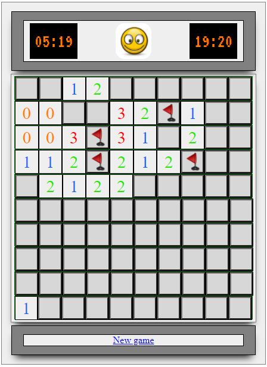

  
game  published at:    https://ev-ran.github.io/Minesweeper/

## Minesweeper

#### Game features

* Size of game board may be changed in code.
* Number of mines depend on game board size. May be changed in code.
* Right-click on a cell marks it with a flag.
* Left-click on a cell reveals it's contents (mine, a number of neighboring cells with mines, or ‘0’ - if it's empty ).
* Click on an empty cell reveals all connected non-mine cells.
* Left-clicking a mine loses the game and reveals all other mine locations.
* Game wins when all non-mined cells were revealed, and all cells with mines are flagged or not touched.
  If win - all cells with mine will be flagged.
* Timer counts seconds since first interaction -  until WIN or LOS result.
* Reset / start new game.

[Not realized yet: no mine by first click]
